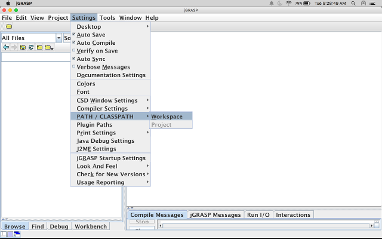
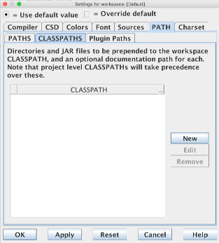
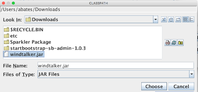

# Windtalker

This Java library was written to allow AP Computer Science students to exercise their
Java skills in a way that is similar to a real world scenario.  Windtalkers is a movie
that depicts the story of [Navajo code talkers](https://en.wikipedia.org/wiki/Code_talker#Navajo_code_talkers) during WWII.  The Navajo code talkers
used their native language in addition to a secret code to communicate positions, orders
and other messages over a radio broadcast.  In this way, our Windtalker Java project
allows students to communicate with each other by broadcasting messages over a network.

The Windtalker project demonstrates real-world scenarious by requiring students to
clearly understand the requirements and implementation of the secret code.  The secret
code is implemented as a [codec](https://en.wikipedia.org/wiki/Codec) (COder DECoder) class
and the Windtalker will use the codec to encode and decode messages on the network.
If students have implemented their codecs the same way, then everyone should be able
to view and understand messages.  If students have implementations that manipulate the
message slightly different then the information will be unintelligible.  This is
demonstrates how everyone involved in a software project needs to be on the same page
as everyone else in order to complete a successful project.

## Example Usage

A codec is any class that implements the co.andrewbates.windtalker.Codec interface.  This
interface specifies two methods: code and decode.  Each method takes a string and returns
a string.  Here is an example codec that users rot47 (similar to 
[rot13](https://en.wikipedia.org/wiki/ROT13))  as the coding/decoding mechanism:

```java

class ExampleCodec implements Codec {
    private char min = 31;
    private int max = 127;

    private String rot47(String message) {
        StringBuilder s = new StringBuilder();
        for (int i = 0; i < message.length(); i++) {
            int c = message.charAt(i) + 48;
            if (c > max) {
                c = min + (c - max);
            }
            s.append((char) c);
        }
        return s.toString();
    }

    @Override
    public String encode(String message) {
        return rot47(message);
    }

    @Override
    public String decode(String message) {
        return rot47(message);
    }

}

```

Once the codec class is created, simply start up the Windtalker:

```java

public class Example {
    public static void main(String[] argv) {
        Codec codec = new ExampleCodec();
        String username = JOptionPane.showInputDialog("Input a username");
        Talk talk = new Talk(username, codec);

        talk.run();
    }
}

```

This complete example is located in the examples directory of this project.

## Using with JGrasp

JGrasp is similar to other IDEs when using external libraries.  Simply obtain the
libraries' jar files and import them into JGrasp's classpath.  Download the windtalker.jar
file and then follow these instrcutions:

In JGrasp, select Settings -> PATH/CLASSPATH -> Workspace from the menu:


Select the CLASSPATH tab in the dialog box and click the New button:



Navigate to the windtalker.jar file that has been downloaded and click the Choose button.



Now the Windtalker code can be imported into your projects:

```Java
import co.andrewbates.windtalker.Codec;
import co.andrewbates.windtalker.Talk;
```
